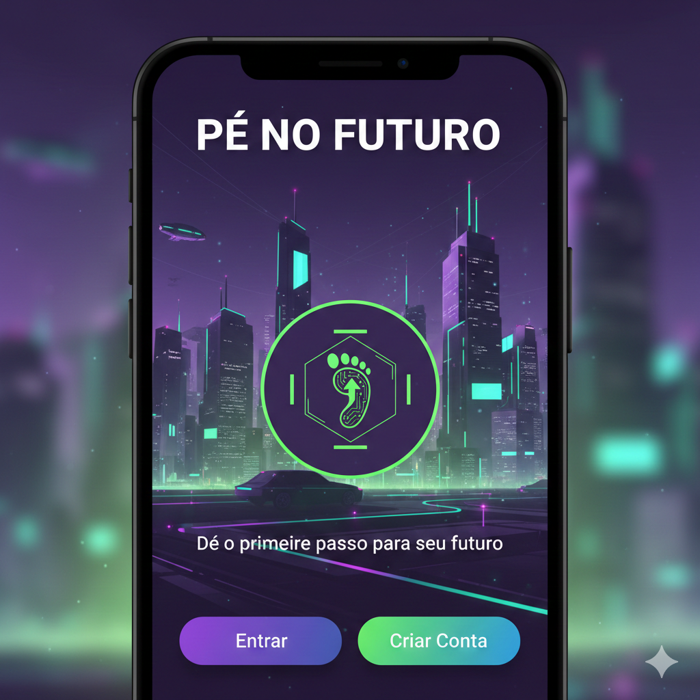
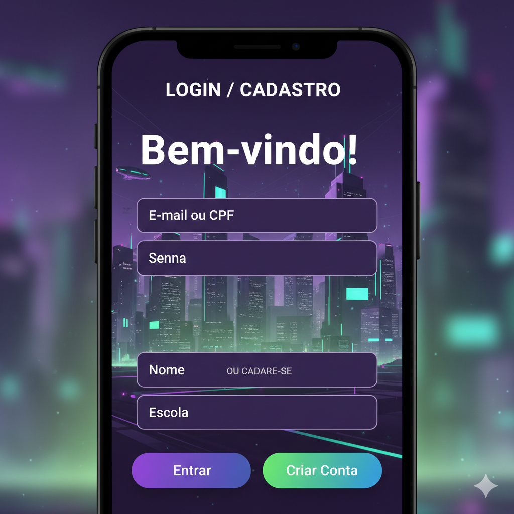
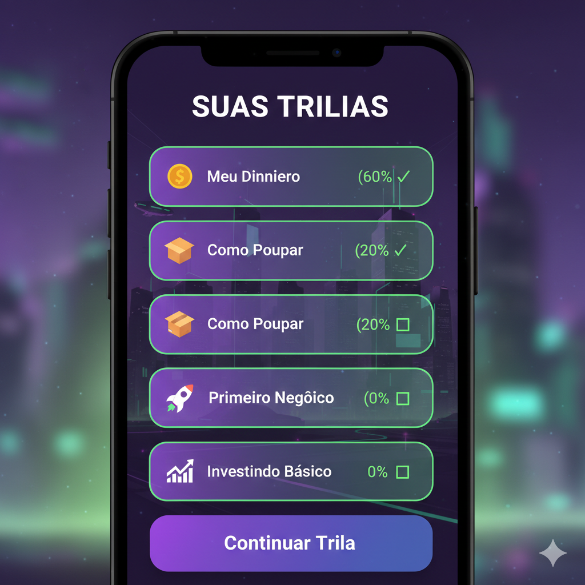
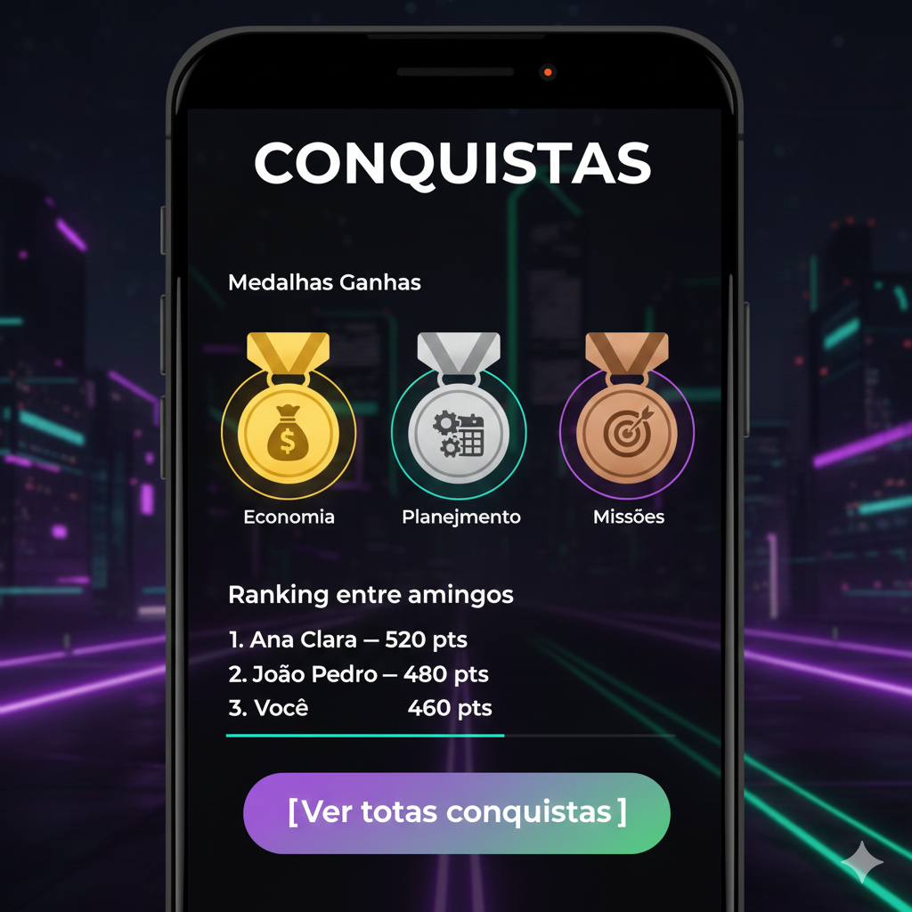
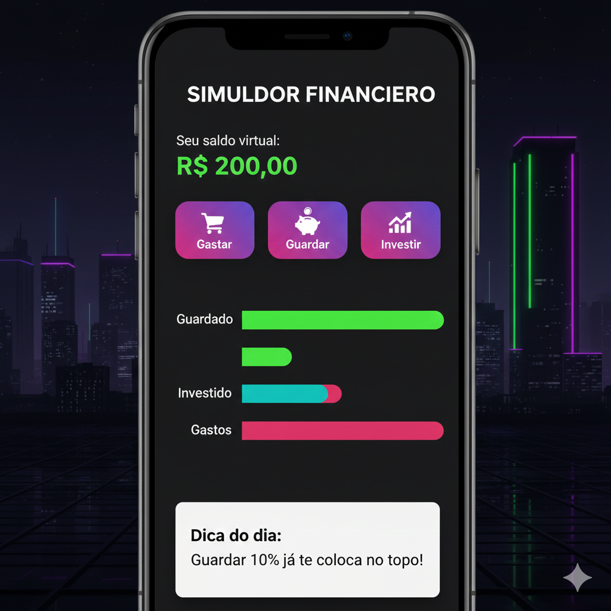

# pe-no-futuro
Prototipo Funcional de um app de educação financeira - TCC curso FIA.

Utilizado o Google Antigravity para geração deste protótipo, foram quatro prompts:

### <Prompt 1> - criação das telas de login, cadastro e dashboard, segue:

```
Olá esta é minha primeira experiencia aqui com vc Antigravity e gostaria de fazer um protótipo funcional de um aplicativo que pretendo demonstrar como prova de valor para uma banca avaliadora de startups. Este aplicativo deve funcionar ao ponto de poder compartilhá-lo com o publico alvo que é um conjunto de estudantes de 14 a 24 anos. 
Trata-s então de um app de educação fincanceira, onde a jornada do cliente como qualquer app inicia-se com o cadastro ou  login e na sequencia o usuário cria um perfil e define suas metas e o app o ajuda a definir missoes.

Como guide de cores pode seguir o seguinte: utilize Paleta exata (roxo #6B4EFF + verde #39FFC0) + combinar as cores da melor forma de modo a engajar o publico jovem, o intuito do app é preparar os joven spara os desafios de uma smat city do futuro..

Como proposta de telas, constui com a ajuda do gemini as seguintes 3 primeiras telas:

Segue descricão das telas:

1. Tela Inicial (Splash / Welcome)

 ----------------------------------------------------

|                    PÉ NO FUTURO                    |

|                                                    |

|           [ Ícone / Logo minimalista ]             |

|                                                    |

|      "Dê o primeiro passo para o seu futuro"       |

|                                                    |

|               [ Entrar ]  [ Criar Conta ]          |

|                                                    |

 ----------------------------------------------------


2. Tela de Cadastro/Login

 ----------------------------------------------------

|                     LOGIN / CADASTRO               |

|                                                    |

|  [ Título ]  Bem-vindo!                            |

|                                                    |

|  [ Campo ]  E-mail ou CPF                          |

|  [ Campo ]  Senha                                   |

|                                                    |

|        [ Entrar ]                                  |

|                                                    |

|  ———————————————                                  |

|   OU CADASTRE-SE                                   |

|                                                    |

|  [ Campo ]  Nome                                   |

|  [ Campo ]  Idade                                  |

|  [ Campo ]  Escola                                  |

|                                                    |

|        [ Criar Conta ]                             |

 ----------------------------------------------------


3. Dashboard Principal

 ----------------------------------------------------

|                   SALDO DO MÊS                     |

|                 R$ 200,00 (virtual)                |

|                                                    |

|        Missão da Semana: "Guardar 10%"             |

|       [ Barra de Progresso: ███░░░░░░ ]            |

|                                                    |

|     Medalhas:  🏅  🏅  ⚪                            |

|                                                    |

|                 [ INICIAR APRENDIZADO ]           |

|                                                    |

|   Menu inferior:  Inicio | Trilhas | Mentor | Perfil |

 ----------------------------------------------------

anexo as telas criadas.
```
,   e 


### <Prompt 2> - criação das telas de trilhas de aprendizado, mentor de IA e tela de conquistas, segue:

``` 
Obrigado Antigravity, vc fez um excelente trabalho até aqui. Vejo que para continuarmos e deixarmos esta aplicação ainda mais funcional, devo te descrever um pouco de como imagino a jornada do usuário a partir da tela 3 (dashboard) que vc criou. 
Imaginamos incialmente a tela 4 - Trilhas como sendo uma porta de entrada para várias opções de assuntos em que o usuário pode se inscrever e cursar. A tela de entrada desta seção seria assim:


4. Trilhas de Microlearning

 ----------------------------------------------------

|                    SUAS TRILHAS                    |

|                                                    |

|  [ Ícone 💰 ]  Meu Dinheiro     (60% ✓)            |

|                                                    |

|  [ Ícone 📦 ]  Como Poupar     (20% ▢)             |

|                                                    |

|  [ Ícone 🚀 ]  Primeiro Negócio (0% ▢)             |

|                                                    |

|  [ Ícone 📈 ]  Investindo Básico (0% ▢)            |

|                                                    |

|                [ Continuar Trilha ]                |

 ----------------------------------------------------
(vide também imagem anexa)

As menções acima são meramente ilustrativas. O que eu gostaria mesmo, para dar uma noção de aprendizado de verdade é de trazer aqui ara dentro do aplicativo a mesma experiência de uma google classroom. Tenho duas salas de aula de exemplo para este mesmo fim e que gostaria que vc as trouxesse aqui para dentro ipsis literis ou até mesmo melhoradas, veja:
1. TOEFL iBT - 14th Edition - Pamela Sharpe
(Inglês Acadêmico) link: https://classroom.google.com/c/Njg0OTU0NzkyNzU4

Ali dentro eu didivo em semanas o aprendizado de inglês nas 4 dimensões Listening, Writing, Speaking e reading, compartilho audio e textos tanto das partes teóricas quanto práticas e ainda crio quizes onde posso aferir as respostas do aluno e atribuir-lhe nota.

Minha idéia é que com meu login (eu te autorizo) vc acesse todas as configurações desta sala e a traga para cá como uma ou duas trilhas de aorendizado de inglEs do TOEFL, inclusive os quizes podem ser utilizados para a depender do nivel de acerto do aluno atribuir-khe notas e ajudá-lo a cumular XP (como vc mesma atribui ali na tela dashboad os XPs ou pontos de experiencias a medida que vão aumentando irão conferindo novos badges ou medalhas para o usuário  se orgulhar e compartilhar com os amigos e marcar sua evolução de aprendizado.

2. Educação Financeira v1.0
(Ativos Financeiros) - link: https://classroom.google.com/c/NDg5OTE5NDk5MzI5

Tenho também esta outra google class onde ensino conteitos de educação financeira através de video aulas da plataforma Khan, para aquelas em que compartilho este link ou dava a aula mentorando virtualmente os alunos em aulas online, e aqui eu não fiz quizes, fiz somente perguntas respondidas textualmente pelo aluno, porém eu mesmo as avalia-va. Aqui caberia  vc trazer para dentro da plataforma (embbedar mesmo) o video do Khan do assunto tratado, ou incluir aqui a trilha inteira a que ela faz parte, obviamente fazendo todas as menções aqui e honras e copyrights a plataforma khan, como aqui é somente um prototipo funcional sem fimns de comercialização mas somente prova de valor/conceito, pode embedar aqui. E para os casos onde há somente um arquivo texto compartilhado e ate mesmo nas respostas textuais, vc pode linkar com o mentor de IA, dando a possibilidade de o jovem interagir com uma IA, pode ser a Gemini ou Grok sobre temas que o afligem quanto a finanças. A interface para a tela 6 (mentor de IA) pode ser como a que segue abaixo:


6. Mentor IA (Chat)

 ----------------------------------------------------

|                   MENTOR IA                        |

|                                                    |

|   👤 IA: "Parabéns! Você economizou 15% este mês." |

|                                                    |

|   👤 Você: [campo para digitar mensagem]           |

|                                                    |

|   Sugestões de ação:                               |

|   [ Criar meta ]  [ Aprender mais ]  [ Simular ]   |

|                                                    |

 ----------------------------------------------------
(vide imagem anexa também).

Essa tela de mentoria pode ser acessada também diretamente no link do rodape da dashboadr (Mentor IA) e para fechar o ciclo uma tela que resuma a experiencia e os badges atingidos pelo usuário, a tela 7 conquista:


7. Tela de Conquistas

 ----------------------------------------------------

|                     CONQUISTAS                     |

|                                                    |

|  Medalhas Ganhas:                                  |

|   🏅 Economia  |  🏆 Planejamento |  🎯 Missões     |

|                                                    |

|  Ranking entre amigos:                             |

|   1. Ana Clara — 520 pts                           |

|   2. João Pedro — 480 pts                          |

|   3. Você — 460 pts                                |

|                                                    |

|                [ Ver todas conquistas ]            |

 ----------------------------------------------------
(vide imagem anexa também).

Vc pode adicionar isto a esta construção aqui feita?  E me avisar para que ue possa acessar novamente  ao local:  http://localhost:5173/ e ver o resultado? Estou ansioso.
```
(Gemini_Generated_Tela4.png), (Gemini_Generated_Tela6.png) e (Gemini_Generated_Tela7.png)

,   e 

### <Prompt 3> - criação das telas da tela de simulação de saldo e atingimentos de pontos de experiencia segue:

``` 
Excelente trabalho até aqui .. e grandes mocks viu, excelente. Pena que não pode incluir aqui de verdade o video do Khan sobre ativos: https://www.youtube.com/watch?v=98qfFzqDKR8,

Agora para fechar completamente o ciclo, cabe ainda trazer a forma como o usuário irá simular o saldo que aparece na parte superiror do dashboard onde é demonstrado o saldo. Pode linka-la com a tela 5 (simulador de saldo), imaginamos seu comportamento como segue abaixo:


5. Simulador Financeiro

 ----------------------------------------------------

|                SIMULADOR FINANCEIRO                |

|                                                    |

|     Seu saldo virtual:  R$ 200,00                  |

|                                                    |

|  [ Gastar ]   [ Guardar ]   [ Investir ]           |

|                                                    |

|  Gráfico:                                          |

|   Guardado: ███████                                |

|   Investido: ██                                     |

|   Gastos:   ████                                   |

|                                                    |

|   Dica do dia: "Guardar 10% já te coloca no topo!" |

 ----------------------------------------------------
(vide imagem anexa)

A medida que ele altera o saldo investido, gasto, ou guardado eles sensibilizam o saldo.

Já para fechar fica fica faltando a definição de missões e sua dinâmica de atingimento. Esta deixo para vc mesmo inferir e criar telas que dêem vida ao restante dos touchpoints das telas que ainda não tem link definido, ok? coisa básica e simples mesmo.
Obrigado até aqui.
``` 



E o que o antigravity gerou foi todo este código aqui em React/Vite e que pretendo disponibilizar via uma conta da Vercel em http://pe-no-futuro.vercel.app.
